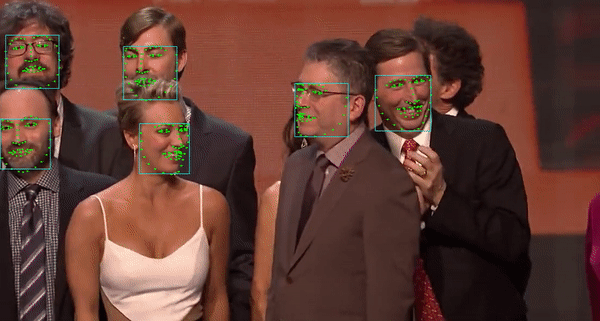

#  Free Mobile Real-Time Face Landmark 106 points Localization

### Introduce
良心级开源人脸标定算法,人脸美颜,美妆,配合式活体检测,人脸校准的预处理步骤.该项目Windows工程基于传统的SDM算法,通过修改开源代码,精简保留测试部分代码,优化代码结构.
Android代码基于深度学习,我们设计了高效的网络模型,该模型鲁棒性较好,支持多人脸跟踪.目前深度学习算法在人脸标定方向取得了良好的效果,该项目旨在提供一种较为简单易用的实现方式.

#### Related Resources
+ [基于HyperLandmark的活体检测](https://xiangzi.site/2019/04/19/iOS/%E6%B4%BB%E4%BD%93%E8%AF%86%E5%88%AB/)
+ [基于SDM的HyperLandmark-iOS实现](https://github.com/elhoangvu/HyperLandmark-iOS) (2019.02.06)
+ [相关技术博客](https://blog.csdn.net/lsy17096535/article/details/81116221)
+ [参考开源SDM算法](https://github.com/chengzhengxin/sdm)。
+ [基于CNN的人脸标定](https://github.com/lsy17096535/face-landmark)。
+ [HyperLandmark 106点序号](https://github.com/zeusees/HyperLandmark/blob/master/images/landmark_order.png)

### Features

+ 106点，人脸轮廓描述更加细腻
+ 准确度高，逆光、暗光情况下依然可以取得良好的标定效果
+ 模型小，跟踪模型2MB左右，非常适合移动端集成
+ 速度快，Android平台代码在 Qualcomm 820 (st) 单张人脸7ms (2018.08.14)
+ 增加多人脸跟踪

### APP

- 体验 Android APP：[http://demo.zeusee.com/HyperLandmark](http://demo.zeusee.com/HyperLandmark)

### Latest Update

+ Add OpenGL based camera interface.

### TODO

+ Dense face landmark (800 points)
+ Facial action recognition
+ Euler angle , face pose estimation. 
+ Open source native tracking code.

### Notes

Windows实现是基于免费intraface实现的，与android并不相同。

###  依赖

+ Windows demo 依赖 OpenCV
+ Android 可直接使用

### Demo

### Contact：

关于人脸标定我们正在进行数据收集与算法开发，技术交流、捐献数据可以加入下群。
+ 交流群 724142079

### Author
- [Jack Yu]( https://github.com/szad670401)(jack-yu-business@foxmail.com)

