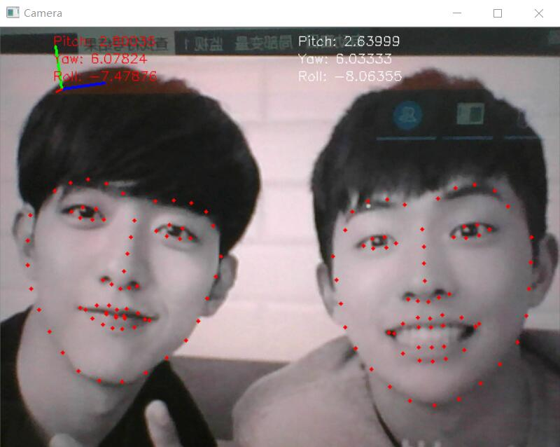

# Open Source Face Landmark

### 介绍
该项目基于传统的SDM算法,通过修改开源代码，精简保留测试部分代码.优化代码结构. 该模型鲁棒性较好,支持多人脸跟踪.目前深度学习算法在人脸标定方向取得了良好的效果,该项目旨在提供一种较为简单易用的实现方式.

#### 相关资源 

+ [参考开源SDM算法](https://github.com/chengzhengxin/sdm)。
+ [基于CNN的人脸标定](https://github.com/lsy17096535/face-landmark)。

### 更新

+ [基于深度学习106点人脸标定,近期跟新代码](https://github.com/zeusees/HyperLandmark/blob/master/resource/106points.mp4)
+ 增加多人脸跟踪
+ 增加106点标定数据,采用算法标注,质量不是特别高.

### TODO

+ 完善android及ios版本
+ SIMD指令优化hog特征提取速度
+ 丰富数据,提交一版106点标定模型

###  依赖

+ OpenCV

### 测试样例

